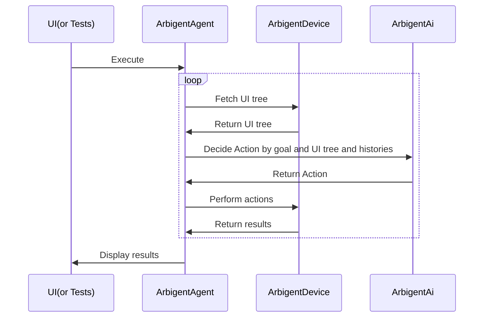
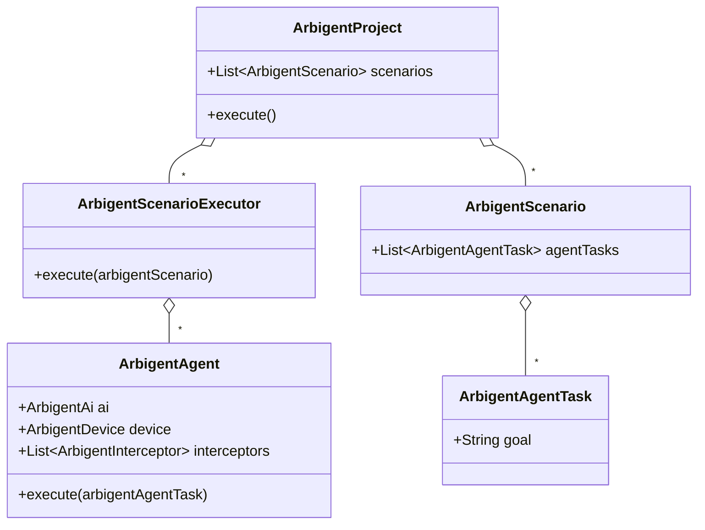

# Arbigent(Arbiter-Agent): An AI Agent Testing Framework for Modern Applications

**Zero to AI agent testing in minutes. Arbigent's intuitive UI and powerful code interface make it accessible to everyone, while its scenario breakdown feature ensures scalability for even the most complex tasks.**


> [!WARNING]
> This project is still under development and may change in the future.

## Screenshot


## Demo movie

https://github.com/user-attachments/assets/46fa3034-5671-4ff1-99df-abbdaebaf197

## Motivation

### Make AI Agent Testing Practical for Modern Applications

Traditional UI testing frameworks often struggle with modern applications because they are brittle and break easily when the UI changes. For instance, updates to tutorials or the appearance of unexpected dialogs can cause tests to fail.  
AI agents emerged as a solution, but testing with AI agents also presents challenges. AI agents often don't work as intended; for example, the agents might open other apps or click on the wrong button due to the complexity of the task.  
To address these challenges, I created Arbigent, an AI agent testing framework that can break down complex tasks into smaller, dependent scenarios. By decomposing tasks, Arbigent enables more predictable and scalable testing of AI agents in modern applications.

### Customizable for Various AI Providers, OSes, Form Factors, etc.

I believe many AI Agent testing frameworks will emerge in the future. However, widespread adoption might be delayed due to limitations in customization. For instance:

*   **Limited AI Provider Support:** Frameworks might be locked to specific AI providers, excluding those used internally by companies.
*   **Slow OS Adoption:** Support for different operating systems (like iOS and Android) could lag.
*   **Delayed Form Factor Support:** Expanding to form factors beyond phones, such as Android TV, might take considerable time.

To address these issues, I aimed to create a framework that empowers users with extensive customization capabilities. Inspired by [OkHttp's interceptor](https://square.github.io/okhttp/features/interceptors/) pattern, Arbigent provides interfaces for flexible customization, allowing users to adapt the framework to their specific needs, such as those listed above.

### Easy Integration into Development Workflows

Furthermore, I wanted to make Arbigent accessible to QA engineers by offering a user-friendly UI. This allows for scenario creation within the UI and seamless test execution via the code interface.

## Features

*   **Achieve Complex Goals Through Scenario Dependencies:** AI agents often struggle with complex tasks. Arbigent addresses this by allowing you to break down goals into smaller, dependent scenarios. For example, you can create a scenario to log in, followed by a dependent scenario to perform a search. The name "Arbigent" was chosen to reflect the framework's role as a mediator, orchestrating the actions of AI agents across multiple scenarios.
*   **UI-Based Scenario Creation, Code-Based Execution:**  Create scenarios visually in the UI and execute them programmatically using a saved project yaml file, allowing to create scenarios by QA engineer and execute by Software engineer.
*   **Support for Multiple Form Factors:**  Arbigent supports testing on iOS, Android, and even TV interfaces using D-pad navigation.
*   **Optimized for AI:**  Through experimentation, I discovered that LLMs perform poorly when presented with the entire UI tree. Arbigent optimizes the UI tree by removing unnecessary information, enhancing the AI's ability to understand and interact with the UI.
*   **Cost-Effective:**  Beyond being open source, Arbigent can utilize models like `GPT-4o mini` to execute tests, significantly reducing costs.
*   **Flexible Code Interface:**  For advanced customization, Arbigent offers a code interface for test execution like adding custom initialization and cleanup methods for scenarios.
*   **Open Source:** Arbigent is free to use, modify, and distribute. Contributions to the project are welcome!

## How to Use

### Installation

Install the Arbigent UI binary from the [GitHub Actions workflow page](https://github.com/takahirom/arbigent/actions/workflows/build-ui.yaml?query=branch%3Amain). Please open the latest successful build and download the artifact.

### Device Connection and AI API Key Entry

1. Connect your device to your PC.
2. In the Arbigent UI, select your connected device from the list of available devices. This will establish a connection.
3. Enter your AI provider's API key in the designated field within the Arbigent UI.


### Scenario Creation

Use the intuitive UI to define scenarios. Simply specify the desired goal for the AI agent.

### Test Execution

Run tests either directly through the UI or programmatically via the code interface or CLI.

### CLI

You can install the CLI via Homebrew and run a saved YAML file.

```bash
brew tap takahirom/homebrew-repo
brew install takahirom/repo/arbigent
```

```
Usage: arbigent [<options>]

Options:
  --ai-type=(openai|gemini)  Type of AI to use
  --os=(android|ios|web)     Target operating system
  --scenario-file=<text>     Path to the scenario YAML file
  -h, --help                 Show this message and exit
```

## Supported AI Providers

| AI Provider | Supported |
|-------------|-----------|
| OpenAI      | Yes       |
| Gemini      | Yes       |

You can add AI providers by implementing the `ArbigentAi` interface.

## Supported OSes / Form Factors

| OS          | Supported |
|-------------|-----------|
| Android     | Yes       |
| iOS         | Yes       |
| Web(Chrome) | Yes       |

You can add OSes by implementing the `ArbigentDevice` interface. Thanks to the excellent [Maestro](https://github.com/mobile-dev-inc/maestro) library, we are able to support multiple OSes.

| Form Factor    | Supported |
|----------------|-----------|
| Phone / Tablet | Yes       |
| TV(D-Pad)      | Yes       |

# Learn More

## Basic Structure

### Execution Flow

The execution flow involves the UI, Arbigent, ArbigentDevice, and ArbigentAi. The UI sends a project creation request to Arbigent, which fetches the UI tree from ArbigentDevice. ArbigentAi then decides on an action based on the goal and UI tree. The action is performed by ArbigentDevice, and the results are returned to the UI for display.



###  Class Diagram

The class diagram illustrates the relationships between ArbigentProject, ArbigentScenario, ArbigentTask, ArbigentAgent, ArbigentScenarioExecutor, ArbigentAi, ArbigentDevice, and ArbigentInterceptor.



### Saved project file

> [!WARNING]
> The yaml format is still under development and may change in the future.

The project file is saved in YAML format and contains scenarios with goals, initialization methods, and cleanup data. Dependencies between scenarios are also defined.
You can write a project file in YAML format by hand or create it using the Arbigent UI.

The id is auto-generated UUID by Arbigent UI but you can change it to any string.

```yaml
scenarios:
  - id: "7788d7f4-7276-4cb3-8e98-7d3ad1d1cd47"
    goal: "Open the Now in Android app from the app list. The goal is to view the list\
    \ of topics.  Do not interact with the app beyond this."
    initializeMethods:
      type: "LaunchApp"
      packageName: "com.google.samples.apps.nowinandroid"
    cleanupData:
      type: "Cleanup"
      packageName: "com.google.samples.apps.nowinandroid"
  - id: "f0ef0129-c764-443f-897d-fc4408e5952b"
    goal: "In the Now in Android app, select an tech topic and complete the form in\
    \ the \"For you\" tab. The goal is reached when articles are displayed.  Do not\
    \ click on any articles. If the browser opens, return to the app."
    dependency: "7788d7f4-7276-4cb3-8e98-7d3ad1d1cd47"
    imageAssertions:
      - assertionPrompt: "Articles should be visible on the screen"
```

## Code Interface

> [!WARNING]
> The code interface is still under development and may change in the future.

Arbigent provides a code interface for executing tests programmatically. Here's an example of how to run a test:


### Dependency

Stay tuned for the release of Arbigent on Maven Central.

### Running saved project yaml file

You can load a project yaml file and execute it using the following code:

```kotlin
class ArbigentTest {
  private val scenarioFile = File(this::class.java.getResource("/projects/nowinandroidsample.yaml").toURI())

  @Test
  fun tests() = runTest(
    timeout = 10.minutes
  ) {
    val arbigentProject = ArbigentProject(
      file = scenarioFile,
      aiFactory = {
        OpenAIAi(
          apiKey = System.getenv("OPENAI_API_KEY")
        )
      },
      deviceFactory = {
        AvailableDevice.Android(
          dadb = Dadb.discover()!!
        ).connectToDevice()
      }
    )
    arbigentProject.execute()
  }
}
```

### Run a scenario directly

```kotlin
val agentConfig = AgentConfig {
  deviceFactory { FakeDevice() }
  ai(FakeAi())
}
val arbigentScenarioExecutor = ArbigentScenarioExecutor {
}
val arbigentScenario = ArbigentScenario(
  id = "id2",
  agentTasks = listOf(
    ArbigentAgentTask("id1", "Login in the app and see the home tab.", agentConfig),
    ArbigentAgentTask("id2", "Search an episode and open detail", agentConfig)
  ),
  maxStepCount = 10,
)
arbigentScenarioExecutor.execute(
  arbigentScenario
)
```

### Run a goal directly

```kotlin
val agentConfig = AgentConfig {
  deviceFactory { FakeDevice() }
  ai(FakeAi())
}

val task = ArbigentAgentTask("id1", "Login in the app and see the home tab.", agentConfig)
ArbigentAgent(agentConfig)
  .execute(task)
```
