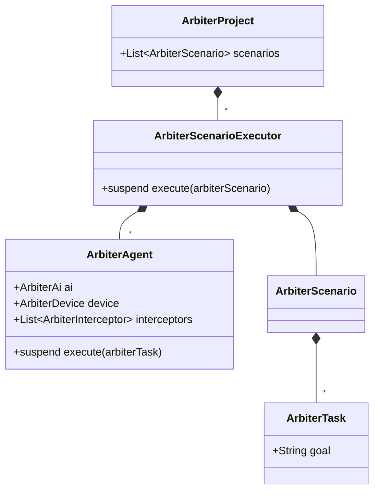

# Arbiter - An AI Agent testing framework and tool

## Motivation

### Customizable for Various AI Providers, OSes, Form Factors, etc.

I believe many AI Agent testing frameworks will emerge in the future. However, widespread adoption might be delayed due to limitations in customization. For instance:

*   **Limited AI Provider Support:** Frameworks might be locked to specific AI providers, excluding those used internally by companies.
*   **Slow OS Adoption:** Support for different operating systems (like iOS and Android) could lag.
*   **Delayed Form Factor Support:** Expanding to form factors beyond phones, such as Android TV, might take considerable time.

To address these issues, I aimed to create a framework that empowers users with extensive customization capabilities. Inspired by OkHttp's interceptor pattern, Arbiter provides interfaces for flexible customization, allowing users to adapt the framework to their specific needs, such as those listed above.

### Easy Integration into Development Workflows

Furthermore, I wanted to make Arbiter accessible to QA engineers by offering a user-friendly UI. This allows for scenario creation within the UI and seamless test execution via the code interface.

## Features

*   **Open Source:** Arbiter is free to use, modify, and distribute. Contributions to the project are welcome!
*   **Achieve Complex Goals Through Scenario Dependencies:** Recognizing that AI agents often struggle with complex tasks, Arbiter allows breaking down goals into smaller, dependent scenarios. For example, you can create a scenario to log in and then have a dependent scenario to perform a search. The name "Arbiter" reflects the library's role in managing AI agents and scenarios.
*   **Cost-Effective:**  Beyond being open source, Arbiter can utilize models like `GPT-4o mini` to execute tests, significantly reducing costs.
*   **Optimized for AI:**  Through experimentation, I discovered that LLMs perform poorly when presented with the entire UI tree. Arbiter optimizes the UI tree by removing unnecessary information, enhancing the AI's ability to understand and interact with the UI.
*   **Flexible Code Interface:**  For advanced customization, Arbiter offers a code interface for test execution.
*   **Support for Multiple Form Factors:**  Arbiter supports testing on iOS, Android, and even TV interfaces using D-pad navigation.
*   **UI-Based Scenario Creation, Code-Based Execution:**  Create scenarios visually in the UI and execute them programmatically using a saved project yaml file.

## How to Use

### Installation

Install the Arbiter UI binary from the [GitHub Releases page](link to your releases).

### Device Connection

Connect your device to your PC. The connected device should appear in the UI, allowing you to establish a connection.

### Scenario Creation

Use the intuitive UI to define scenarios. Simply specify the desired goal for the AI agent.

### Test Execution

Run tests either directly through the UI or programmatically via the code interface.

# Learn More

## Basic Structure

### Execution Flow

The execution flow involves the UI, Arbiter, ArbiterDevice, and ArbiterAi. The UI sends a project creation request to Arbiter, which fetches the UI tree from ArbiterDevice. ArbiterAi then decides on an action based on the goal and UI tree. The action is performed by ArbiterDevice, and the results are returned to the UI for display.


###  Class Diagram

The class diagram illustrates the relationships between ArbiterProject, ArbiterScenario, ArbiterTask, ArbiterAgent, ArbiterScenarioExecutor, ArbiterAi, ArbiterDevice, and ArbiterInterceptor.



## Code Interface

**WORING:** The code interface is still under development and may change in the future.

Arbiter provides a code interface for executing tests programmatically. Here's an example of how to run a test:

### Running saved project yaml file

You can load a project yaml file and execute it using the following code:

```kotlin
class ArbiterTest {
  private val scenarioFile = File(this::class.java.getResource("/projects/nowinandroidsample.yaml").toURI())

  @Test
  fun tests() = runTest(
    timeout = 10.minutes
  ) {
    val arbiterProject = ArbiterProject(
      file = scenarioFile,
      aiFactory = {
        OpenAIAi(
          apiKey = System.getenv("OPENAI_API_KEY")
        )
      },
      deviceFactory = {
        AvailableDevice.Android(
          dadb = Dadb.discover()!!
        ).connectToDevice()
      }
    )
    arbiterProject.execute()
  }
}
```

### Run a scenario directly

```kotlin
val agentConfig = AgentConfig {
  device(FakeDevice())
  ai(FakeAi())
}
val arbiterScenarioExecutor = ArbiterScenarioExecutor {
}
val arbiterScenario = ArbiterScenario(
  id = "id2",
  agentTasks = listOf(
    ArbiterScenarioExecutor.ArbiterAgentTask("id1", "goal1", agentConfig),
    ArbiterScenarioExecutor.ArbiterAgentTask("id2", "goal2", agentConfig)
  ),
  maxStepCount = 10,
)
arbiterScenarioExecutor.executeAsync(
  arbiterScenario
)
```

### Run a goal directly

```kotlin
val agentConfig = AgentConfig {
  device(FakeDevice())
  ai(FakeAi())
}

val task = ArbiterScenarioExecutor.ArbiterAgentTask("id1", "goal1", agentConfig)
ArbiterAgent(agentConfig)
  .execute(task)
```
