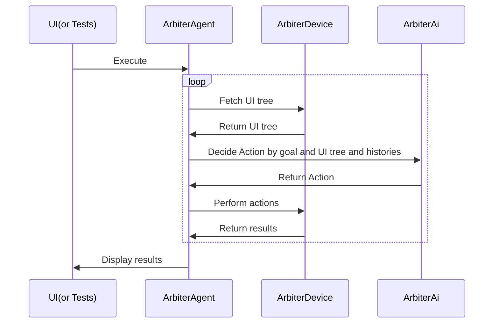
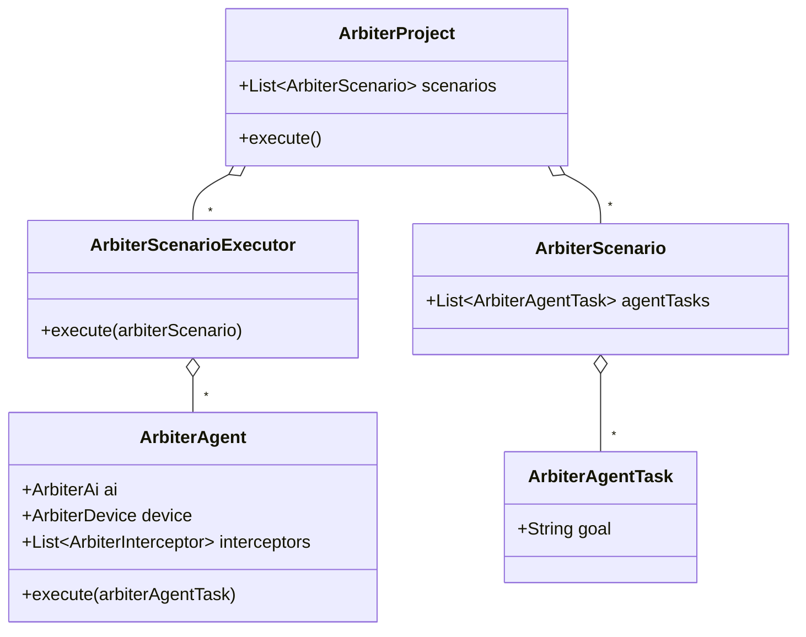

# Arbiter: An AI Agent Testing Framework for Modern Applications

**Zero to AI agent testing in minutes. Arbiter's intuitive UI and powerful code interface make it accessible to everyone, while its scenario breakdown feature ensures scalability for even the most complex tasks.**


> [!WARNING]
> This project is still under development and may change in the future.

## Screenshot


## Demo movie

https://github.com/user-attachments/assets/46fa3034-5671-4ff1-99df-abbdaebaf197

## Motivation

### Make AI Agent Testing Practical for Modern Applications

Testing UI with traditional testing frameworks is challenging because they easily break when the UI changes, such as during tutorial updates or when dialogs are displayed.  
AI agents emerged as a solution, but testing with AI agents also presents challenges. AI agents often don't work as intended; for example, they might open other apps or click on the wrong button due to the complexity of the task.  
To address these challenges, I created Arbiter, an AI agent testing framework that can break down complex tasks into smaller, dependent scenarios. This approach enables more predictable and scalable testing of AI agents in modern applications.

### Customizable for Various AI Providers, OSes, Form Factors, etc.

I believe many AI Agent testing frameworks will emerge in the future. However, widespread adoption might be delayed due to limitations in customization. For instance:

*   **Limited AI Provider Support:** Frameworks might be locked to specific AI providers, excluding those used internally by companies.
*   **Slow OS Adoption:** Support for different operating systems (like iOS and Android) could lag.
*   **Delayed Form Factor Support:** Expanding to form factors beyond phones, such as Android TV, might take considerable time.

To address these issues, I aimed to create a framework that empowers users with extensive customization capabilities. Inspired by [OkHttp's interceptor](https://square.github.io/okhttp/features/interceptors/) pattern, Arbiter provides interfaces for flexible customization, allowing users to adapt the framework to their specific needs, such as those listed above.

### Easy Integration into Development Workflows

Furthermore, I wanted to make Arbiter accessible to QA engineers by offering a user-friendly UI. This allows for scenario creation within the UI and seamless test execution via the code interface.

## Features

*   **Achieve Complex Goals Through Scenario Dependencies:** Recognizing that AI agents often struggle with complex tasks, Arbiter allows breaking down goals into smaller, dependent scenarios. For example, you can create a scenario to log in and then have a dependent scenario to perform a search. The name "Arbiter" reflects the library's role in managing AI agents and scenarios.
*   **UI-Based Scenario Creation, Code-Based Execution:**  Create scenarios visually in the UI and execute them programmatically using a saved project yaml file, allowing to create scenarios by QA engineer and execute by Software engineer.
*   **Support for Multiple Form Factors:**  Arbiter supports testing on iOS, Android, and even TV interfaces using D-pad navigation.
*   **Optimized for AI:**  Through experimentation, I discovered that LLMs perform poorly when presented with the entire UI tree. Arbiter optimizes the UI tree by removing unnecessary information, enhancing the AI's ability to understand and interact with the UI.
*   **Cost-Effective:**  Beyond being open source, Arbiter can utilize models like `GPT-4o mini` to execute tests, significantly reducing costs.
*   **Flexible Code Interface:**  For advanced customization, Arbiter offers a code interface for test execution like adding custom initialization and cleanup methods for scenarios.
*   **Open Source:** Arbiter is free to use, modify, and distribute. Contributions to the project are welcome!

## How to Use

### Installation

Install the Arbiter UI binary from the [GitHub Releases page](link to your releases).

### Device Connection and AI API Key Entry

1. Connect your device to your PC. 
2. The connected device should appear in the UI. Select your device to establish a connection.
3. Enter the API key for the AI. 


### Scenario Creation

Use the intuitive UI to define scenarios. Simply specify the desired goal for the AI agent.

### Test Execution

Run tests either directly through the UI or programmatically via the code interface.


## Supported AI Providers

| AI Provider | Supported |
|-------------|-----------|
| OpenAI      | Yes       |
| Gemini      | Yes       |

You can add AI providers by implementing the `ArbiterAi` interface.

## Supported OSes / Form Factors

| OS          | Supported |
|-------------|-----------|
| Android     | Yes       |
| iOS         | Yes       |
| Web(Chrome) | Yes       |

You can add OSes by implementing the `ArbiterDevice` interface. Thanks to the excellent [Maestro](https://github.com/mobile-dev-inc/maestro) library, we are able to support multiple OSes.

| Form Factor    | Supported |
|----------------|-----------|
| Phone / Tablet | Yes       |
| TV(D-Pad)      | Yes       |

# Learn More

## Basic Structure

### Execution Flow

The execution flow involves the UI, Arbiter, ArbiterDevice, and ArbiterAi. The UI sends a project creation request to Arbiter, which fetches the UI tree from ArbiterDevice. ArbiterAi then decides on an action based on the goal and UI tree. The action is performed by ArbiterDevice, and the results are returned to the UI for display.



###  Class Diagram

The class diagram illustrates the relationships between ArbiterProject, ArbiterScenario, ArbiterTask, ArbiterAgent, ArbiterScenarioExecutor, ArbiterAi, ArbiterDevice, and ArbiterInterceptor.



### Saved project file

> [!WARNING]
> The yaml format is still under development and may change in the future.

The project file is saved in YAML format and contains scenarios with goals, initialization methods, and cleanup data. Dependencies between scenarios are also defined.
You can write a project file in YAML format by hand or create it using the Arbiter UI.

The id is auto-generated UUID by Arbiter UI but you can change it to any string.

```yaml
scenarios:
- id: "7788d7f4-7276-4cb3-8e98-7d3ad1d1cd47"
  goal: "Just see Now in Android app from app list. Goal is just to see list of topics.\
    \ Do not interact with the app"
  initializeMethods:
    type: "LaunchApp"
    packageName: "com.google.samples.apps.nowinandroid"
  cleanupData:
    type: "Cleanup"
    packageName: "com.google.samples.apps.nowinandroid"
- id: "f0ef0129-c764-443f-897d-fc4408e5952b"
  goal: "Select an interesting topic in now in android. Please goal when there are\
    \ articles in \"For you\" tab. Don't click an article. If you open browser please\
    \ go back."
  dependency: "7788d7f4-7276-4cb3-8e98-7d3ad1d1cd47"
```

## Code Interface

> [!WARNING]
> The code interface is still under development and may change in the future.

Arbiter provides a code interface for executing tests programmatically. Here's an example of how to run a test:


### Dependency

Stay tuned for the release of Arbiter on Maven Central.

### Running saved project yaml file

You can load a project yaml file and execute it using the following code:

```kotlin
class ArbiterTest {
  private val scenarioFile = File(this::class.java.getResource("/projects/nowinandroidsample.yaml").toURI())

  @Test
  fun tests() = runTest(
    timeout = 10.minutes
  ) {
    val arbiterProject = ArbiterProject(
      file = scenarioFile,
      aiFactory = {
        OpenAIAi(
          apiKey = System.getenv("OPENAI_API_KEY")
        )
      },
      deviceFactory = {
        AvailableDevice.Android(
          dadb = Dadb.discover()!!
        ).connectToDevice()
      }
    )
    arbiterProject.execute()
  }
}
```

### Run a scenario directly

```kotlin
val agentConfig = AgentConfig {
  deviceFactory { FakeDevice() }
  ai(FakeAi())
}
val arbiterScenarioExecutor = ArbiterScenarioExecutor {
}
val arbiterScenario = ArbiterScenario(
  id = "id2",
  agentTasks = listOf(
    ArbiterAgentTask("id1", "Login in the app and see the home tab.", agentConfig),
    ArbiterAgentTask("id2", "Search an episode and open detail", agentConfig)
  ),
  maxStepCount = 10,
)
arbiterScenarioExecutor.execute(
  arbiterScenario
)
```

### Run a goal directly

```kotlin
val agentConfig = AgentConfig {
  deviceFactory { FakeDevice() }
  ai(FakeAi())
}

val task = ArbiterAgentTask("id1", "Login in the app and see the home tab.", agentConfig)
ArbiterAgent(agentConfig)
  .execute(task)
```
